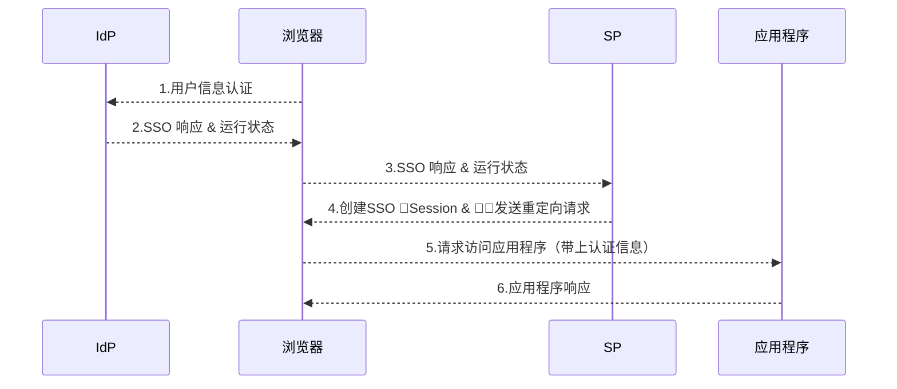
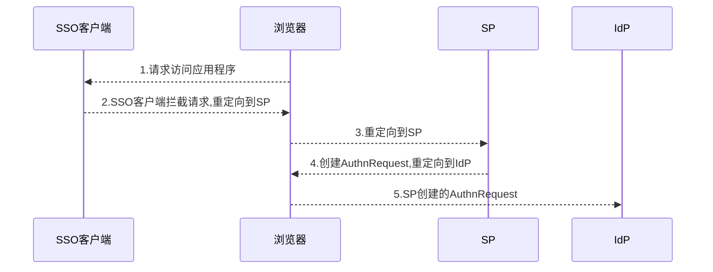
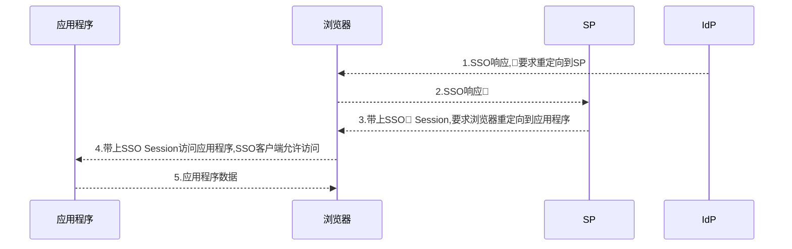
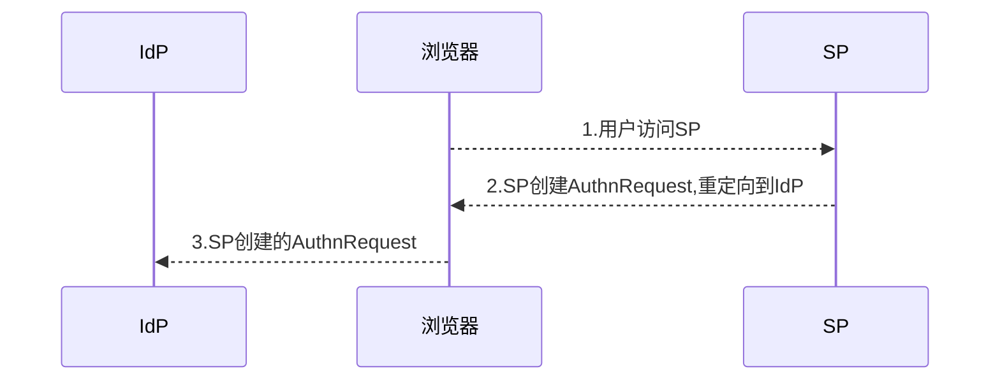

[本文引用](https://blogs.oracle.com/dcarru/sp-vs-idp-initiated-sso)
这篇文章介绍一下 SSO 系统的两种认证流程:IdP Flow 和 SP Flow,主要包括

- 基本概念:SSO,IdP,SP,SAML；
- 什么是 IdP Flow；
- 什么是 SP Flow；

#### 基本概念

- SP Flow: SP 发起的 SSO 认证流程
- IdP Flow:IdP 发起的 SSO 认证流程
- [SSO](https://en.wikipedia.org/wiki/Single_sign-on): Single sign-on 的缩写,SSO 是一个访问控制系统,用户登录 SSO 之后,可以访问 SSO 关联的系统.
- [IdP](<https://en.wikipedia.org/wiki/Identity_provider_(SAML)>): Identity Provider 的缩写,拥有用户信息的系统,用户的认证是在 IdP 里面处理.
- [SAML](https://en.wikipedia.org/wiki/SAML_2.0):Security Assertion Markup Language 的缩写,可以用来交换认证和授权信息.
- [SP](<https://en.wikipedia.org/wiki/Service_provider_(SAML)>): Service Provider 的缩写,SP 用来接收和处理 IdP 发送的数据,比如 SAML 断言语句,SP 不需要接触用户的密码等敏感信息,SP 接收的数据完全取决于 IdP.

#### SSO 拓扑图

一个 SSO 系统的典型结构包括下列部分:

- IdP: 保存着用户信息,也是用户认证的地方；
- SP: SP是一个集合,一般包括
  - SP服务器
  - SSO服务器（有时候 SSO 和 SP 是同一个）
  - SSO客户端,客户端一般和 SSO 相互沟通,客户端的作用是保护受限制的网络资源,认证通过的用户才可以访问,认证不通过的用户是无法访问受限制的资源的
- 应用程序: 用户想要访问的资源

这篇文章关于SP Flow和IdP Flow的流程介绍都是基于SAML 2.0,其他的协议和SAML 2.0都是比较相似的.

#### IdP Flow

IdP Flow指的是从IdP发起的SSO认证流程,用户访问请求先到达IdP,经过认证操作之后IdP产生一个SSO响应然后重定向到 SP ,重定向请求会带上一个响应的消息以及一个可选的字段（运行状态）,SP 验证 SSO 响应,验证通过之后会重定向到应用程序.

其中SSO响应按照协议分类有很多类型:

- SAML 2.0: 带有断言的SAML响应
- SAML 1.1: 带有断言的响应
- WS-Fed: 带有断言的响应
- OpenID 2.0: OpenID 2.0响应

在IdP Flow中,运行状态包含一个重定向地址,不管验证通过与否,SP都需要知道接下来要重定向的位置,不同的协议运行状态的实现方式也不一样:

- SAML 2.0: RelayState 参数
- SAML 1.1: TARGET 参数
- WS-Fed: wctx 参数
- OpenID 2.0: 不支持 IdP 发起的 SSO

状态通常是在 URL 中传递,所以运行状态的消息不能过大,否则会超过重定向 URL 的字符长度限制（浏览器限制）.
这种流程的应用场景是 IdP 需要访问 SP 托管的资源.这种实现有个缺点,它会无视 SP 已有的  认证信息,比如第一次认证通过之后,1 分钟之后再次发起认证,这个时候第一次的认证信息可能还是有效的,但是第二次认证不会考虑第一次认证的结果,而是当作一个全新的认证过程.
IdP Flow 一般的流程如下:

- 用户在浏览器访问 IdP,而且需要指定
  - 要用的 SP 服务
  - 重定向 URL,应用程序地址,可选,因为可以在 SP 中配置
- IdP 校验用户信息之后,会创建一个 SSO 响应,这里是一个 SAML 2.0 断言消息,然后重定向到 SP,同时带上断言消息和运行状态
- SP 验证 SAML 2.0 断言消息,将用户重定向到应用程序
- 浏览器请求访问应用程序,这种访问会带上 Session.
- 浏览器接收应用程序响应

#### SP Flow

SP Flow 是指先访问 SP 的认证流程:用户需要先访问 SP ,然后 SP 生成认证请求跳转到 IdP ,IdP 认证通过之后,根据 SP 发送过来的信息跳转回 SP,这个时候会带上 SAML2.0 断言消息,SP 验证断言消息之后再跳转到应用程序.SP 生成认证请求包含两个部分:授权请求和运行状态,按照不同协议也分为不同的类型.
认证请求:

- SAML 2.0: AuthnRequest
- SAML 1.1: 一个带有表示 SP 信息的 URL
- WS-Fed: 一个带有 wtrealm 参数的 URL,wtrealm 参数带有 SP 的信息和其它可选信息
- OpenID 2.0: OpenID 2.0 请求

运行状态:运行状态数据在 SP 上产生,然后发送到 IdP,IdP 会解析状态码数据

- SAML 2.0: RelayState 参数
- SAML 1.1: TARGET 参数
- WS-Fed: wctx 参数
- OpenID 2.0: openid.return_to 参数,这个参数是一个 SP 地址链接,用户在 IdP 完成认证之后会跳转到这个链接,这个地址在 SP 生成,这个链接包含状态相关的参数
  和 IdP Flow 类似,这个状态码数据不能太大,因为它包含在 URL 中,不能超过浏览器对 url 长度的限制.不过 SP 可以采用下面的方式来处理状态码
- 将状态码春存在 SP 的内存或者数据库里面
- 用 RelayState/TARGET/wctx 来指向状态码

SP Flow 的流程如下

- 浏览器访问应用程序
- SSO 客户端拦截请求,判断用户是否需要做认证,如果需要认证就发起一个重定向响应给浏览器
- 浏览器根据重定向 url 访问 SP
- SP 判断 IdP 类型,创建一个 AuthnRequest（针对 SAML2.0）,保存操作状态然后把请求重定向到 IdP
- 浏览器访问 IdP,访问的时候带上 AuthnRequest 数据

IdP 接收到 AuthnRequest 之后,会对用户信息进行一系列判断（是否需要登录, 用户登录状态是否过期...）,之后继续进行后续的流程

- IdP 创建一个 SSO 响应,响应会带上断言和认证的数据,然后将请求重定向到 SP
- 浏览器将 SSO 响应发送给 SP
- SP 校验断言,然后创建 SSO Session,然后 SP 将用户重定向到应用程序
- 浏览器访问应用程序
- 应用程序返回响应给浏览器

#### 另外一种 SP Flow

上面介绍的 SP Flow,浏览器需要先访问应用程序,SSO 客户端拦截之后再重定向到 SP ,还有一种 Flow,就是浏览器直接访问 SP ,SP 事先配置了应用程序地址和 IdP 地址,SP 判断 IdP 类型然后重定向到 IdP,IdP 认证通过之后重定向到 SP ,SP 解析 IdP 的 SSO 响应然后重定向到应用程序.和前者的区别在于第一步是直接访问 SP .
这种 SP Flow 的流程如下

- 浏览器访问 SP
- SP 判断用户认证的 IdP 类型和地址,创建一个 AuthnRequest（针对 SAML2.0）,保存操作状态然后把请求重定向到 IdP
- 用户访问 IdP,带上 AuthnRequest 参数

### 总结

上面描述了三种 SSO 系统的实现方式,介绍了他们的工作流程,总的来说分为两种

- 浏览器先访问 SSO 客户端,然后跳转到 SP/IdP 完成认证
- 用户直接访问 IdP/SP,需要在 IdP 或者 SP 中配置应用程序地址,在完成认证之后进行跳转到应用程序
  比较推荐的方式是第一种,因为 SSO 客户端可以保存用户的认证信息,如果用户完成了认证,在有效期内用户可以直接访问应用程序,但是后者不会考虑当前的登录状态,每次都需要完整的认证流程,这对服务器来说负载会增大.

### **References**

- [SP VS IdP initialted SSO](https://blogs.oracle.com/dcarru/sp-vs-idp-initiated-sso)
- [AWS Cognito IdP initiated Authentication Flow](https://docs.aws.amazon.com/cognito/latest/developerguide/cognito-user-pools-saml-idp-authentication.html)
- [SSO Wiki](https://en.wikipedia.org/wiki/Single_sign-on)
- [SAML Wiki](https://en.wikipedia.org/wiki/Security_Assertion_Markup_Language)
- [IdP Wiki](<https://en.wikipedia.org/wiki/Identity_provider_(SAML)>)
- [SP Wiki](<https://en.wikipedia.org/wiki/Service_provider_(SAML)>)
